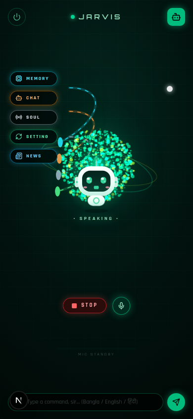
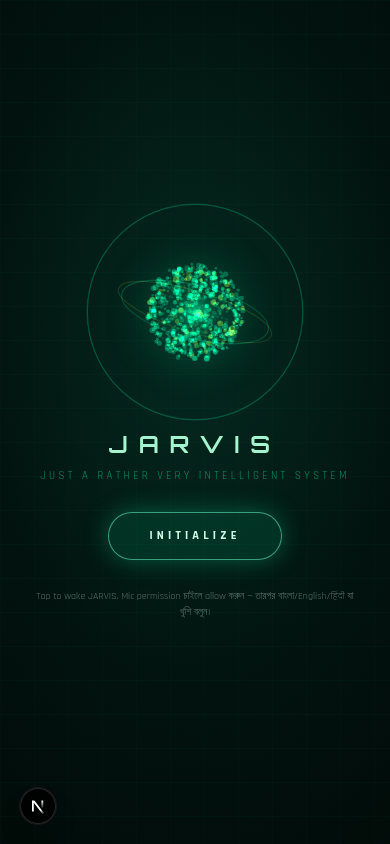
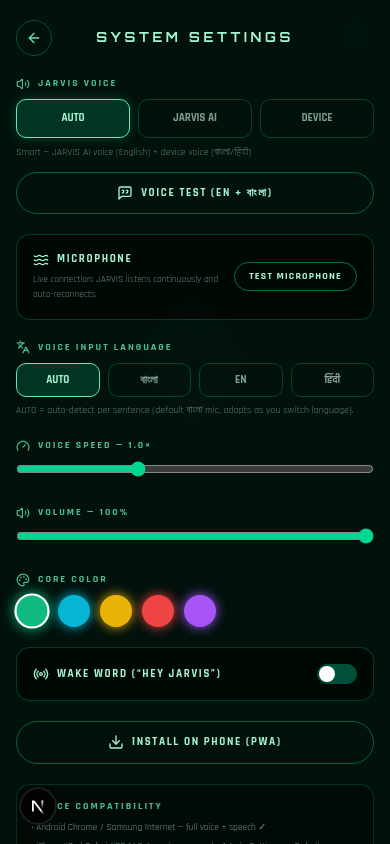

# 🤖 JARVIS — Real-Life AI Assistant (Web · Windows · Android)

> A voice-controlled AI assistant inspired by a viral TikTok concept — rebuilt as a **real, working multi-platform product** with a genuine AI brain (GLM), **Bangla / English / हिंदी** voice, and a cinematic sci-fi UI. One brain, every device.


<p align="center">
  
  
  
</p>

---

## ✨ Features

- 🎙️ **Voice commands in 3 languages** — Bangla (বাংলা), English & हिंदी auto-detected per command.
- 🧠 **Two voice-input engines (new!)** — fast **browser** speech recognition *plus* an **AI CLOUD engine** (mic → GLM speech-to-text) that makes voice work in the **desktop app, Android app, Firefox and even iOS**. AUTO mode picks the right one and switches transparently.
- ⚡ **Lightning-fast replies** — the brain streams sentence-by-sentence; JARVIS **speaks while still thinking** (~0.6–2 s, time/date <100 ms).
- 🖥️📱 **Windows `.exe` + Android `.apk` (new!)** — real installable apps that load the SAME JARVIS brain. Built automatically by GitHub Actions on every release.
- 🔗 **Multi-device network (new!)** — every install (Web PWA / Windows / Android) registers itself and appears on the website under **SETTING → MY DEVICES** with live online status. Send a command to any device from the website — it **speaks and executes it there**, then replies back.
- 🎬 **Real actions:** open apps ("instagram kholo"), play real YouTube songs ("sunflower song chalao"), add/complete tasks by voice, live news headlines, permanent memory, instant time/date.
- 🗂️ **4 modules** like the original video — **MEMORY · CHAT · SOUL · SETTING** (+ NEWS), particle orb (900 particles, 4 states), cute anime robot buddy, hybrid TTS with automatic fallback (never silent), PWA installable, barge-in typing.

## 🏗 Project structure

```
jarvis/
├── client/                 # Next.js 16 app — the website, the UI and the AI brain API
│   ├── src/app/api/        #   jarvis (GLM brain, streaming) · tts · asr · news · tasks ·
│   │                       #   messages · settings · devices (+SSE relay) · download
│   ├── src/components/jarvis/  # jarvis-app · orb · jarvis-bot · screens
│   ├── src/lib/jarvis/     #   speech.ts (hybrid TTS + 2 voice engines) · types.ts
│   ├── prisma/schema.prisma    # Task · Message · Setting · Device
│   └── db/custom.db        #   ready-made demo database
├── server/                 # Optional standalone device hub (zero-dep Node, for Vercel deploys)
│   └── device-hub.mjs
├── electron/               # Windows desktop app → archer.exe (+ NSIS installer)
│   ├── main.js             #   loads your JARVIS website, mic permissions, server picker
│   └── build/icon.png
├── android/                # Capacitor Android project → archer.apk (signed release)
├── www/                    # Android first-run "enter your site URL" page
├── .github/workflows/
│   └── build-release.yml   # Auto-builds archer.exe + archer.apk on tags & manual runs
├── capacitor.config.json
└── package.json            # root scripts (dev/build/db:push/hub/cap:sync)
```

## 📋 Requirements

| Requirement | Details |
|---|---|
| **Node.js** | **v20+** (v22 LTS recommended) |
| **Z.AI API access** | The AI brain / cloud voice / news / AI speech-to-text need a **Z.AI API key** (step 4) |
| **Browser (web)** | Chrome / Edge / Samsung Internet recommended; **Firefox & iOS now get voice too** via the AI engine |
| **Windows app** | Windows 10/11 x64 — just download `archer.exe`, no install needed |
| **Android app** | Android 6+ — install `archer.apk`, allow "install from this source" |

## ⚡ Installation (full process)

### 1) Clone

```bash
git clone https://github.com/fahad-ahamed4/jarvis-ai-assistant.git
cd jarvis-ai-assistant
```

### 2) Install (client + root tooling)

```bash
npm install            # root: Capacitor CLI + platform (for Android builds)
cd client
npm install            # client: Next.js app dependencies
cd ..
```

### 3) Environment file

```bash
cp client/.env.example client/.env
```

Content (SQLite database inside `client/db/`):

```env
DATABASE_URL=file:../db/custom.db
```

> A demo database **is included** (`client/db/custom.db`) — works instantly. For a fresh start, delete it and run `npm run db:push`.

### 4) Z.AI API config  (`.z-ai-config`)

The brain uses `z-ai-web-dev-sdk`, which reads a `.z-ai-config` file (project root or home dir):

```bash
cp .z-ai-config.example .z-ai-config
```

```json
{
  "baseUrl": "https://api.z.ai/api/v1",
  "apiKey": "YOUR_ZAI_API_KEY"
}
```

⚠️ Never commit your real `.z-ai-config` — it's git-ignored.

### 5) Database (Prisma)

```bash
npm run db:push        # creates/syncs SQLite tables
```

### 6) Run the website 🚀

```bash
npm run dev            # → http://localhost:3000 (from the repo root)
```

Tap **INITIALIZE**, allow the microphone — JARVIS is alive. (Production: `npm run build` then `npm start` — Next.js standalone, plain Node, no bun needed.)

### 7) Deploy it (so apps & phones can connect)

Any HTTPS host works — VPS (recommended: `node .next/standalone/server.js` behind Caddy/Nginx), Vercel (note: SQLite is ephemeral there — use the [standalone device hub](#-device-hub-for-vercel) if you rely on MY DEVICES), or your z.ai preview link.

> 📱 **Phone (PWA):** open the site in Chrome → ⋮ → *Add to Home screen*.

## 🖥️📱 Get the Windows & Android apps

### Easiest — from inside JARVIS itself

Open **SETTING → GET THE JARVIS APP** on your deployed website and tap:

- **WINDOWS (.exe)** → downloads `archer.exe` from the latest GitHub release
- **ANDROID (.apk)** → downloads `archer.apk`

The buttons auto-serve whatever GitHub Actions built last — no GitHub visit needed.

### First run of each app

Both apps ask once for your **JARVIS website URL** (the address you deployed in step 7), then behave exactly like the website — same orb, same voice, same commands. They instantly appear on the website under **SETTING → MY DEVICES** with a live ● ONLINE badge.

### Building the apps yourself

```bash
# Windows (on a Windows machine):
cd electron && npm install && npm run dist     # → electron/dist/archer.exe

# Android (anywhere with JDK 17):
npm install && npx cap sync android
cd android && ./gradlew assembleRelease        # → android/archer-release.apk
```

### 🤖 Auto-build (GitHub Actions)

Every push of a version tag (or a manual **Run workflow** click on the Actions tab) builds both apps on GitHub's servers and attaches them to a Release:

```bash
git tag v1.0 && git push origin v1.0
```

That's where the SETTING download buttons point — fully automatic.

## 🔗 Device network — how it works

```
Website (browser) ──┐                    ┌── Windows app (archer.exe)
Android app ────────┼──► JARVIS server ──┼──► Web PWA (phone)
Tablet PWA ─────────┘    (Next.js API +   └── Any other install
                          SSE relay)
                          │
                          ▼
            Same GLM brain · same tasks · same memory · same settings
```

- Each install registers (id + name + platform) and heartbeats every 45 s.
- **SETTING → MY DEVICES** shows every device, live online status, and a **COMMAND** box — type `kemon acho` there and the phone/PC JARVIS **says it out loud and acts**.
- The device replies back and the website shows its answer as a toast.

## 🎤 Voice command examples

| Language | Say this | What happens |
|---|---|---|
| বাংলা | "ইনস্টাগ্রাম খোলো" | Instagram opens |
| বাংলা | "মনে রাখো আমার বাসা ঢাকায়" | Saved to memory |
| Banglish | "sunflower song chalao" | Plays *Sunflower* on YouTube |
| English | "What's today's news?" | Speaks live headlines |
| हिंदी | "एक टास्क जोड़ो — video upload karna hai" | Task added (like the original video) |

## ⚙️ SETTING screen

| Control | What it does |
|---|---|
| **JARVIS VOICE** | AUTO (smart routing) / JARVIS AI (cloud) / DEVICE (offline) |
| **VOICE INPUT ENGINE** | AUTO / BROWSER (fast native) / AI CLOUD (GLM speech-to-text — works everywhere) |
| **MIC TEST / VOICE TEST** | One-tap diagnostics |
| **GET THE JARVIS APP** | ⬇️ archer.exe + ⬇️ archer.apk (latest CI build) |
| **MY DEVICES** | Live device network + remote commands |
| Soul / orb color / speed / volume / wake word | Personality & look |

## 🌐 Browser & platform compatibility

| Platform | Voice input | Voice output | Notes |
|---|---|---|---|
| Chrome / Edge / Samsung Internet | ✅ native | ✅ | Best experience |
| **Windows app (archer.exe)** | ✅ AI engine | ✅ | Chromium without Google speech keys → AI engine auto-activates |
| **Android app (archer.apk)** | ✅ AI engine | ✅ | WebView has no speech service → AI engine auto-activates |
| Firefox | ✅ AI engine | ✅ | Used to be typing-only — now full voice! |
| iOS Safari | ✅ AI engine | ✅ (after first tap) | PWA install via Share menu |

## 🧯 Troubleshooting

| Problem | Fix |
|---|---|
| "Microphone blocked" | Chrome → ⋮ → Site settings → Microphone → **Allow**. Windows app: Windows Settings → Privacy → Microphone |
| Download buttons say BUILD QUEUED | No release yet — push a tag (or Actions → Run workflow) and wait ~6-10 min |
| App can't reach the website | Re-check the URL in the app (Electron menu: **JARVIS → Switch Server…**, Ctrl+S). Android: clear app data to re-enter |
| YouTube sign-in wall | Only on datacenter IPs/VPNs — normal phones/WiFi play fine; **OPEN IN YOUTUBE** always works |
| News fails | `.z-ai-config` missing/invalid — the brain needs it for live search |
| AI engine typo-prone | Speak clearly; the clip is transcribed by GLM — proper nouns may vary |

## 🛠 Tech stack

Next.js 16 (App Router, standalone) · React 19 · TypeScript 5 (strict builds) · Tailwind CSS 4 · Prisma 6 + SQLite · z-ai-web-dev-sdk (GLM chat/TTS/ASR/search) · Web Speech API · MediaRecorder · Canvas 2D particle engine · SSE relay · PWA · Electron 37 · Capacitor 7 · GitHub Actions

## 🇧🇩 বাংলা ইনস্টল গাইড (সংক্ষেপে)

```bash
# ১) clone + install (Node.js 20+)
git clone https://github.com/fahad-ahamed4/jarvis-ai-assistant.git
cd jarvis-ai-assistant && npm install && cd client && npm install && cd ..

# ২) environment + API key
cp client/.env.example client/.env
cp .z-ai-config.example .z-ai-config   # → নিজের Z.AI apiKey বসাও

# ৩) database + চালাও
npm run db:push
npm run dev        # → http://localhost:3000 → INITIALIZE
```

**Windows app:** SETTING → GET THE JARVIS APP → WINDOWS (.exe) ডাউনলোড করে চালাও → প্রথমবার তোমার ওয়েবসাইটের URL দাও।
**Android app:** ANDROID (.apk) ইনস্টল করো → প্রথমবার URL দাও → ফোনটা ওয়েবসাইটের MY DEVICES এ দেখা যাবে, ওয়েবসাইট থেকে সরাসরি command পাঠানো যাবে!

## 📄 License

[MIT](LICENSE) © 2026 fahad-ahamed4

---

*Inspired by a TikTok concept video — rebuilt from scratch as a real multi-platform product. "I am JARVIS, sir. Always at your service."* 🤖
